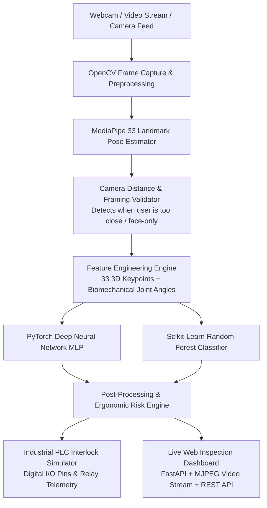

# 🧍‍♂️ Industrial Human Posture AI Inspector & Edge Ergonomics Solution

[](https://www.python.org/)
[](https://opencv.org/)
[](https://google.github.io/mediapipe/)
[](https://pytorch.org/)
[](https://scikit-learn.org/)
[](https://fastapi.tiangolo.com/)
[](LICENSE)

An end-to-end **Industrial Computer Vision & Edge AI Inspection System** for real-time human posture classification, ergonomic strain monitoring, camera distance framing guidance, and simulated **PLC (Programmable Logic Controller) digital I/O safety triggers**.

Engineered for workplace safety, automated industrial quality assurance, and edge AI inspection pipelines.

---

## 🏗️ System Architecture



---

## 🔥 Key Technical Features

1. **Real-Time Pose Tracking & Landmark Extraction**:
   - Leverages **OpenCV** and **MediaPipe Pose** to detect and track 33 3D body keypoints in real time.
   - Computes scale-normalized spatial coordinates invariant to operator distance and camera zoom.

2. **Camera Distance & Framing Guidance**:
   - Automatically detects when an operator is too close to the camera (e.g. face-only visible, shoulders/hips out of frame).
   - Dynamically triggers `STEP BACK (TOO CLOSE)` and `FRAMING WARNING` alerts across the OpenCV HUD and Web Dashboard to ensure proper posture analysis framing.

3. **Biomechanical Feature Engineering (108 Dimensions)**:
   - Calculates real-time joint angles: Torso Spine Inclination, Neck Angle, Knee Flexion/Extension, Hip Angle, and Shoulder Tilt.
   - Generates a robust **108-dimensional feature vector** combining 99 normalized landmark coordinates + 9 biomechanical angle ratios.

4. **Multi-Model AI Classification Pipeline**:
   - **PyTorch Neural Network (MLP)**: Deep learning model built with BatchNorm, Dropout, and ReLU activations (**>99.0% accuracy**).
   - **Scikit-Learn Random Forest Classifier**: High-speed ML model for lightweight edge deployment (**99.5% accuracy**).
   - Classifies postures across `sitting`, `standing`, `bending`, and `slouching` classes.

5. **Industrial PLC & Edge IoT Signal Dispatcher**:
   - Simulates hardware digital I/O relay pins for automated industrial safety interlocks:
     - `PLC_OUT_NORMAL_OP`: High signal (1) during healthy ergonomic operations.
     - `PLC_OUT_ALARM_LIGHT`: Triggered during posture strain or slouching.
     - `PLC_OUT_BUZZER_ALERT`: Audible warning signal for operator ergonomic risk.
     - `PLC_OUT_CONVEYOR_HALT`: Safety stop relay signal for hazardous bending postures.
   - Emits real-time JSON telemetry over REST API endpoints (`/api/telemetry`).

6. **High-Tech Web Inspection Dashboard**:
   - Built with **FastAPI**, **MJPEG Video Streaming**, and a modern **Glassmorphism Dark Theme**.
   - Features typography using Google Fonts (**Plus Jakarta Sans** & **JetBrains Mono**), animated confidence gauges, active signal pulse rings, and an interactive PLC relay status matrix.

---

## 📊 Model Performance & Benchmarks

| Model | Architecture | Accuracy | Inference Latency | Feature Input |
|---|---|---|---|---|
| **PyTorch MLP** | 4-layer Deep Neural Net | **99.00%** | ~12 ms | 108 Dims |
| **Random Forest** | 100 Trees Ensemble | **99.50%** | ~4 ms | 108 Dims |

---

## 🚀 Quickstart & Usage

### 1. Installation

Clone the repository and install required dependencies:

```bash
git clone https://github.com/ShivrajSS-git/HUMAN-POSTURE-ESTIMATION-using-AIML.git
cd HUMAN-POSTURE-ESTIMATION-using-AIML
pip install -r requirements.txt
```

### 2. Launch Live Web Inspection Dashboard

Start the high-tech FastAPI web dashboard server and open `http://localhost:8000` in your browser:

```bash
python main.py --mode dashboard --port 8000
```

### 3. Run Live Webcam Pose Inspector

Run real-time pose tracking and posture prediction on your local camera (Press `'q'` to exit, `'s'` to save snapshot):

```bash
python main.py --mode webcam
```

### 4. Run Test Image Inspection Mode

Inspect a sample image file with full HUD overlays and PLC telemetry output:

```bash
python main.py --mode test-image
```

### 5. Train & Evaluate Models

Train PyTorch & Scikit-Learn models with dataset loading and data augmentation:

```bash
python main.py --mode train
```

### 7. Deploy to Vercel (Serverless Cloud)

Deploy the FastAPI Web Dashboard & AI Inference System to **Vercel** with a single command:

#### Option A: Using Vercel CLI
```bash
npm i -g vercel
vercel
```

#### Option B: Deploy via GitHub Integration
1. Push your repository to GitHub.
2. Go to [Vercel Dashboard](https://vercel.com/new) and import your repository.
3. Vercel automatically detects `vercel.json` and `api/index.py` for Python serverless deployment!

---

## 📁 Repository Structure

```
.
├── posture_inspector/
│   ├── tracker.py                 # OpenCV + MediaPipe pose tracker & HUD visualizer
│   ├── feature_extractor.py       # Joint angle, framing validator & 108-dim feature engine
│   ├── models/
│   │   ├── classifier.py          # PyTorch MLP & Scikit-Learn model wrappers
│   │   ├── train.py               # Dataset loader, training & evaluation pipeline
│   │   ├── posture_net.pth        # Trained PyTorch model weights
│   │   └── posture_rf.pkl         # Trained Random Forest model weights
│   ├── edge_integration/
│   │   └── plc_dispatcher.py      # Industrial PLC digital I/O & telemetry simulator
│   └── dashboard/
│       └── app.py                 # FastAPI live MJPEG video stream & web dashboard
├── HUMAN POSTURE ESTIMATION/
│   ├── run_posture.py             # Standalone test runner script
│   ├── images_dataset/            # Image dataset directories
│   └── test_images/               # Test image samples
├── tests/
│   └── test_pipeline.py           # Pytest unit test suite
├── main.py                        # Unified CLI entry point
├── requirements.txt               # Dependencies list
├── .gitignore                     # Git ignore rules
└── README.md                      # System documentation
```

---

## 📜 License

Distributed under the MIT License. See `LICENSE` for details.
